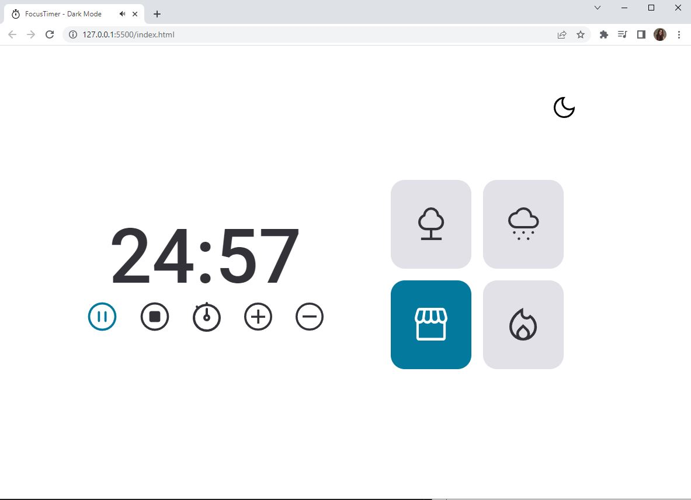
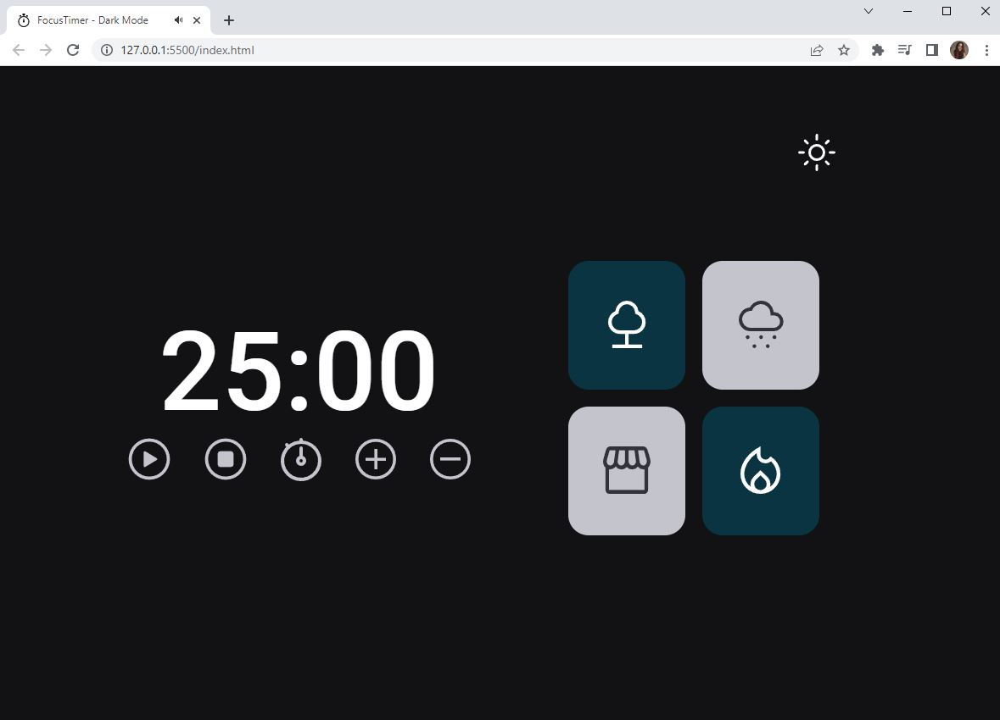

# Cronômetro

É uma aplicação onde criamos um Cronômetro com algumas opções de funcionalidades para o usuário. O Cronômetro é baseado em um estilo de estudo chamado Pomodoro, onde o estudando fica um determinado tempo focado nos estudos e realiza pequenas pausas quando chega ao final do tempo.

## Funcionalidades

- Temas dark e light
- Botões parqa adicionar ou remover 5 Minutos
- Botão para adicionar o tempo desejado
- Botões de Play e pause
- Opções de sons ambientes como:
    - Floresta
    - Chuva
    - Cafeteria
    - Lareira

## Screenshots

